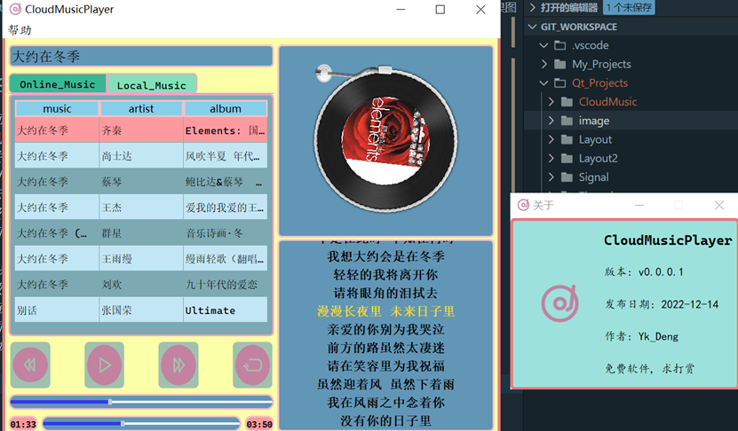
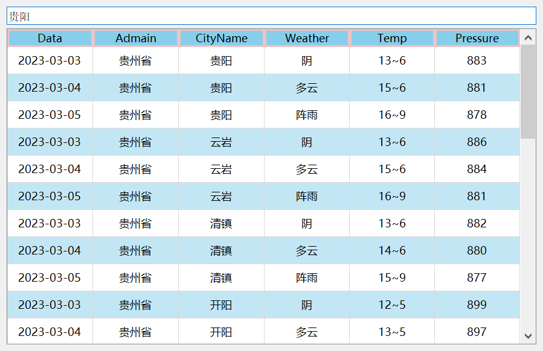

# 开发环境: Windows
# 开发工具: 
1. QT Creator v5.9.3
2. [GetMan](https://getman.cn/)
3. Chrome开发者工具
4. HIM NIS Edit应用程序打包工具
---
## [Cloud Music Player项目](./CloudMusic/)
### 描述
1. 利用 QT Creator 设计图形化界面, 通过浏览器开发者工具获取相关音乐数据并通过
Get Man 解析 Json 数据，最终实现播放曲目等功能。
2. 可以通过搜索歌手或曲目播放相关音频
3. 可以旋转显示该音乐对应的专辑封面
4. 可以滚动显示歌词信息并居中显示正在播放的歌词
5. 以通过对应的按钮实现上下曲目及随机顺序播放
6. 可以通过滚动条调整音乐播放时间
### 类描述
1. MusicInterface类负责显示界面效果
2. MusicPlayer类负责显示实时播放进度条
3. HttpHandle类负责进行网站数据获取和解析
4. GraphicView类负责解析专辑封面
5. DiskItem 与 DisPoinItem分别负责展示专辑封面的动画和唱针的动画
### 效果图
- 
---
## [天气预报](./Weather/)
### 描述
- 借助和风天气API获取天气数据, 数据格式为JSON, 解析后展示给用户
### 效果图
- 
